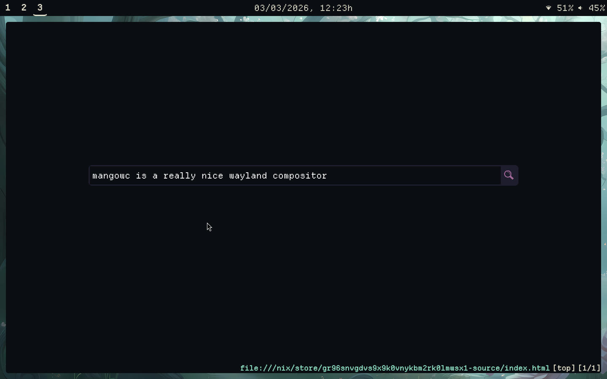

# ❄️ NixOS Config

*Anybody is free to use, modify or look into the code!*

## Table of Contents
- [Overview](#overview)
- [Wallpapers](#wallpapers)
- [Shortcut Cheatsheet](#shortcut-cheatsheet)
- [Installed Software](#installed-software)

## Overview

Organized through the power of Home Manager, flakes plus modules, and GitHub referencing.

Personal quickmarks are declared. The [startpage](https://github.com/notawyvern/search) is too and refers to a repository itself. Home Manager allows deep tweaking into apps, both on CLI and GUI. Vi mode on fish is enabled. And these things are just the tip of the iceberg.

## Wallpapers

The file [stylix.nix](./nixos/syspkgs/stylix.nix) references one. So change the line. The built-in code fetches my wallpaper repo and copies some really nice images to the /nix/store. If you're interested, [take a look](https://github.com/notawyvern/wallpapers).

## Shortcut Cheatsheet

The Windows or the Super key is used as Mod (modifier). The following keys are the most important.

- **Mod+b**: opens qutebrowser
- **Mod+w**: launches tofi menu (an app chooser alternative to dmenu)
- **Mod+t**: opens the alacritty terminal
- **Mod+q**: closes the currently focused window
- **Mod+number**: changes the workspace
- **Ctrl+Alt+Space**: quits mangowc back to gtkgreet
- **Mod+Shift+u**: powers off
- **Mod+Shift+r**: reboots

## Installed Software

The majority of the packages are declared in [homemgr](./nixos/homemgr) and [syspkgs](./nixos/syspkgs). Cherry picking them might save some bandwidth and time when rebuilding NixOS. It is a wise measure, since the deployment can be faster.

The directory [pkgs](./nixos/homemgr/pkgs) contain mostly software I find non-essential. Though it still has a few important ones. They are the following:

* **IT**
    - VSCodium
    - git
    - Alacritty as a terminal emulator
    - Vim
    - htop
    - fish (as in Home Manager)

* **FUN**
    - FreeTube
    - Spotube + yt-dlp

* **GENERAL**
    - vlc
    - fastfetch
    - KolourPaint
    - Qalculate!'s GTK version
    - featherpad
    - iwgtk
    - pcmanfm-qt
    - pavucontrol-qt
    - lxqt-archiver
    - sioyek (a pdf viewer)
    - swayimg to view images
