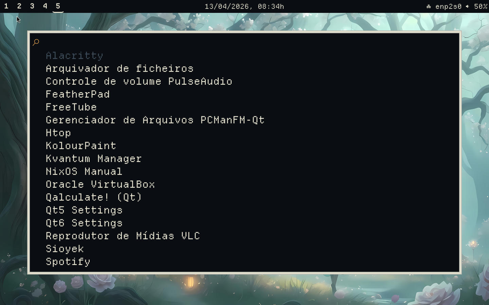
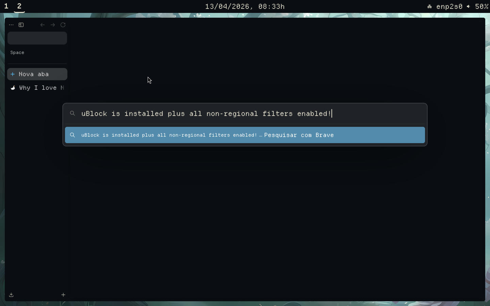

# ❄️ NixOS Config

*Anybody is free to use, modify or look into the code!*

## Table of Contents
- [Introduction](#introduction)
- [Tree](#Tree)
    - [Structure](#structure)
- [Installed Software](#installed-software)
- [Shortcut Cheatsheet](#shortcut-cheatsheet)
- [Wallpapers](#wallpapers)
- [Screenshoots](#screenshoots)

## Introduction

>[!CAUTION]
> This configuration is highly opinionated and very unstable. You may adopt it, but it is wiser to study or copy parts of it only.

It is a personal project. While scopes are reproducible, my needs weigh more. However, it is good to read as a fellow NixOS user. Then you won't bother with problems already solved.

## Tree

>[!IMPORTANT]
>There is no hardware configuration by design; remember to [generate it](https://wiki.nixos.org/wiki/Nixos-generate-config). 

>[!IMPORTANT]
>Currently, Limine secure boot is not fully declarative on NixOS. The [wiki page](https://wiki.nixos.org/wiki/Limine#Secure_Boot) can help you enable it.

```bash
.
├── assets
│   ├── mango-desk.jpg
│   └── zenbrowser.jpg
├── flake.lock
├── flake.nix
├── LICENSE
├── modules
│   ├── core
│   │   ├── audio.nix
│   │   ├── boot.nix
│   │   ├── locale.nix
│   │   ├── network.nix
│   │   ├── pkgmgr.nix
│   │   ├── sourcing.nix
│   │   ├── swap.nix
│   │   └── users.nix
│   ├── global
│   │   ├── loginmgr.nix
│   │   ├── services.nix
│   │   └── stylix.nix
│   └── homemgr
│       ├── home.nix
│       ├── mangowc
│       │   ├── mango-core.nix
│       │   └── mango.nix
│       └── pkgs
│           ├── cli.nix
│           ├── gui.nix
│           ├── unstable.nix
│           └── zen-browser.nix
└── README.md
```

### Structure:

The configuration implements the dendritic pattern. Files can be freely moved in [modules](./modules/) without consequences.

In [core](./modules/core/) are features for a usable NixOS. User crh is declared but mutable. Brazilian Portuguese is enforced. 

From within *core*, [sourcing.nix](./modules/core/sourcing.nix) file declares systems and all modules directly, except for Home Manager's ones.

The [global](./modules/global/) path locates extras. [loginmgr.nix](./modules/global/loginmgr.nix) partly references stylix, so better both be enabled.

At [homemgr](./modules/homemgr/) lots of heavily tweaked software are installed. It is needed for a GUI session and a must for a desktop PC. The main file [home.nix](./modules/homemgr/home.nix) sources its modules and configures xdg.

## Installed Software

The majority of the packages are declared in [homemgr](./modules/homemgr) and [global](./modules/global). Cherry picking them might save some bandwidth and time when rebuilding NixOS.

The directory [pkgs](./modules/homemgr/pkgs) contain mostly software I find non-essential. Though it still has a few important ones. Most of them if not all follow:

* **IT**
    - VSCodium
    - git
    - Alacritty as a terminal emulator
    - VirtualBox
    - Vim
    - htop
    - fish (as in Home Manager)

* **FUN**
    - FreeTube
    - Spotube

* **GENERAL**
    - mpv (uosc gui)
    - fastfetch
    - KolourPaint
    - Zen Browser
    - Qalculate!'s GTK version
    - featherpad
    - pcmanfm-qt
    - lxqt-archiver
    - sioyek (a pdf viewer)
    - swayimg to view images

>[!NOTE]
>Click the waybar icons to configure network or audio through GUI.

## Shortcut Cheatsheet

The Windows or the Super key is used as Mod (modifier). The following keys are the most important.

- **Arrow keys**: press during boot to select generations
- **Mod+b**: opens browser
- **Mod+w**: launches tofi menu (an app chooser alternative to dmenu)
- **Mod+t**: opens the alacritty terminal
- **Mod+q**: closes the currently focused window
- **Mod+number**: changes the workspace
- **Ctrl+Alt+Space**: quits mangowc back to gtkgreet
- **Mod+Shift+u**: powers off
- **Mod+Shift+r**: reboots

## Wallpapers

[flake.nix](./flake.nix) references one. Just change the line. The line fetches an image from my wallpaper repo to the /nix/store. If you're interested in it, [take a look](https://github.com/notawyvern/wallpapers).

## Screenshoots




