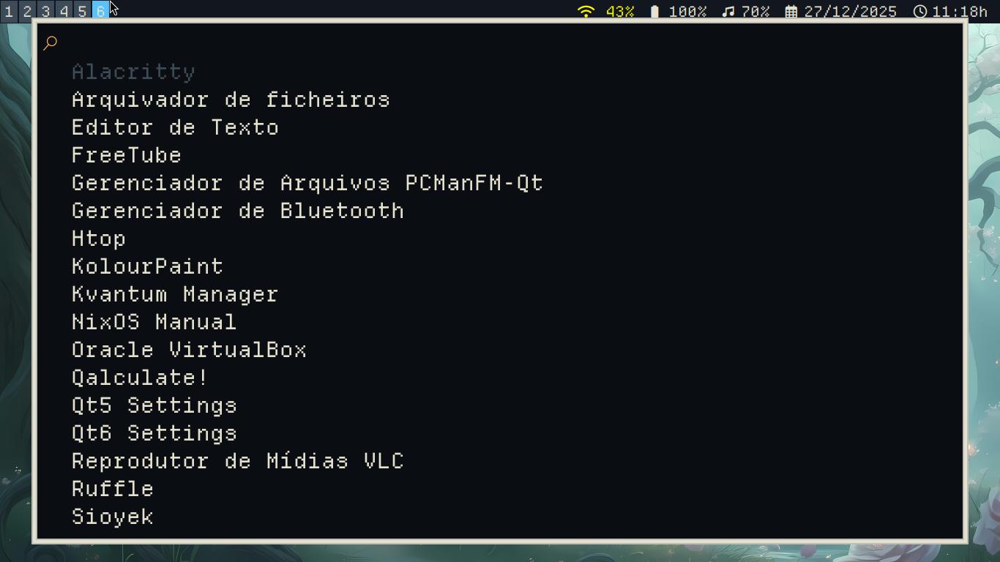
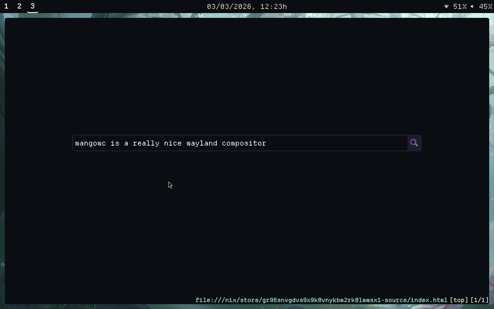

# ❄️ NixOS Config

*Anybody is free to use, modify or look into the code!*

## Table of Contents
- [Overview](#overview)
- [How to Change the Wallpaper?](#how-to-change-the-wallpaper)
- [Shortcut Cheatsheet](#shortcut-cheatsheet)
- [Installed Software](#installed-software)
- [Common Issues](#common-issues)
    - [Home Manager Won't Build](#home-manager-wont-build)
    - [Rebuild Don't Installs Limine](#rebuild-dont-installs-limine)
    - [Secure Boot Doesn't Work](#secure-boot-doesnt-work)

## Overview

Organized through the power of Home Manager, flakes plus modules, and GitHub referencing.

Personal quickmarks are declared. The [startpage](https://github.com/notawyvern/search) is too and refers to a repository itself. Home Manager allows deep tweaking into apps, both on CLI and GUI. Vi mode on fish is enabled. And these things are just the tip of the iceberg.

## Wallpapers

The file [stylix.nix](./nixos/syspkgs/stylix.nix) references one. So change the line. The built-in code fetches my wallpaper repo and copies some really nice images to the /nix/store. If you're interested, [take a look](https://github.com/notawyvern/wallpapers).

## Shortcut Cheatsheet

The Windows or the Super key is used as Mod (modifier). The following keys are the most important.

- **Mod+b**: opens qutebrowser
- **Mod+w**: launches tofi menu (an app chooser alternative to dmenu)
- **Mod+t**: opens the alacritty terminal
- **Mod+q**: closes the currently focused window
- **Mod+number**: changes the workspace
- **Ctrl+Alt+Space**: quits sway back to gtkgreet
- **Mod+Shift+u** powers off
- **Mod+Shift+r** reboots

## Installed Software

The majority of the packages are declared in [homemgr](./nixos/homemgr) and [syspkgs](./nixos/syspkgs). Cherry picking them might save some bandwidth and time when rebuilding NixOS. It is a wise measure, since the deployment can be faster.

The directory [pkgs](./nixos/homemgr/pkgs) contain mostly software I find non-essential. Though it still has a few important ones. They are the following:

- FreeTube
- haruna
- VSCodium
- fastfetch
- ruffle
- KolourPaint
- Spotube + ytdlp
- Vim
- htop
- fish (as in Home Manager)
- git
- Qalculate!'s GTK version
- featherpad
- pcmanfm-qt
- lxqt-archiver
- iwgtk
- sioyek (a pdf viewer)
- swayimg to view images
- Alacritty as a terminal emulator

You can be a minimalist and get rid of what is relevant, including by removing it elsewhere, but this is an untested route. The beauty of Linux is that you can do whatever you want. If so, you still can use some reference.

## Common Issues

### Home Manager Won't Build

Probably your dotfiles are getting in the way. I suggest moving them to the .bak format for using later on. 

### Rebuild Don't Installs Limine

Make sure your system is pointing to its EFI file in order to boot. You can do so through your firmware vendor, the BIOS/UEFI, or by using [efibootmgr](https://wiki.archlinux.org/title/Unified_Extensible_Firmware_Interface#efibootmgr).

### Secure Boot Doesn't Work

Check [this](https://mynixos.com/nixpkgs/option/boot.loader.limine.secureBoot.enable) link for reference. It will guide you on what to do.

